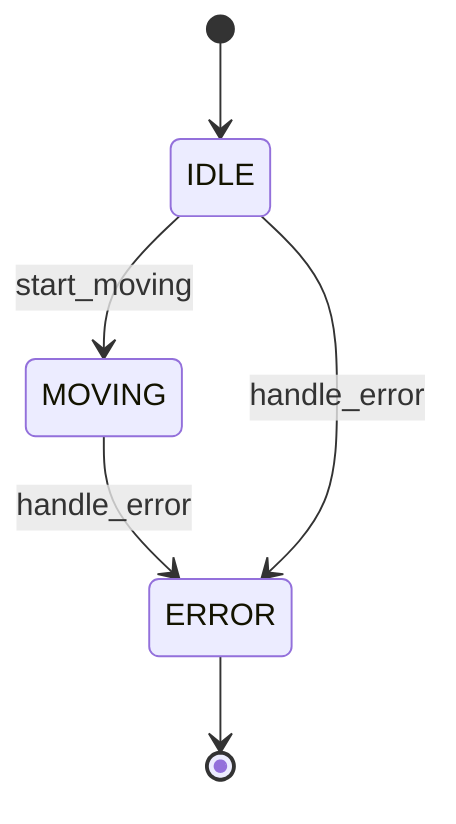

# Code to FSM Analyzer

Analyze your codebase to automatically extract state machine patterns and generate beautiful Mermaid diagrams.

## 🌟 Key Features

- **Intelligent Code Analysis**: Uses Claude to understand state machine logic in any programming language
- **Automatic Diagram Generation**: Creates beautiful Mermaid state diagrams with interactive HTML viewer
- **Interactive Mode**: Chat with Claude about your state machine
- **Multi-Language Support**: Works with Python, JavaScript, TypeScript, C++, Java, and more
- **Auto-Open in Browser**: Generated diagrams open automatically with zoom and export features

## 🚀 Installation & Setup

**Requirements:**
- Node.js 14+
- [Claude Code CLI](https://claude.com/claude-code)

**Install:**
```bash
cd code-to-fsm
npm install
```

**Verify Claude CLI:**
```bash
claude --version
```

See [SETUP.md](./SETUP.md) for detailed setup instructions and troubleshooting.

## 📖 Usage

### Analyze a Codebase

```bash
# Basic analysis
node cli.js analyze /path/to/your/robot/project

# Analyze specific files
node cli.js analyze ./my-project -f robot_controller.py motor_driver.py

# Focus on specific component
node cli.js analyze ./my-project --focus "navigation system"

# Custom output location
node cli.js analyze ./my-project -o ./output
```

### Interactive Mode

Chat with Claude about your state machine:

```bash
node cli.js interactive /path/to/your/project -f robot_controller.py
```

Example conversation:
```
You: What states does the robot have?
Claude: The robot has 7 states: IDLE, INITIALIZING, READY, MOVING, PAUSED, ERROR, and SHUTDOWN...

You: How does it handle errors?
Claude: The robot can enter the ERROR state from any state except SHUTDOWN...

You: Can you show me the state diagram?
Claude: [generates Mermaid diagram]
```

## 🎯 How It Works

### Architecture

```
┌─────────────────────────────────────────────────┐
│  Your Codebase                                  │
│  ├── robot_controller.py                        │
│  ├── motor_driver.cpp                           │
│  └── sensor_manager.js                          │
└──────────────────┬──────────────────────────────┘
                   │
                   │ 1. Scan & Read Files
                   ▼
┌─────────────────────────────────────────────────┐
│  Code-to-FSM Analyzer                           │
│  • Finds relevant files                         │
│  • Reads code                                   │
│  • Builds context                               │
└──────────────────┬──────────────────────────────┘
                   │
                   │ 2. Send to Claude
                   ▼
┌─────────────────────────────────────────────────┐
│  Claude API                                     │
│  • Understands code semantics                   │
│  • Identifies state patterns                    │
│  • Extracts transitions                         │
│  • Generates Mermaid diagram                    │
└──────────────────┬──────────────────────────────┘
                   │
                   │ 3. Process Results
                   ▼
┌─────────────────────────────────────────────────┐
│  Output                                         │
│  ├── state-machine.mmd  (Mermaid diagram)      │
│  ├── analysis.txt       (Full analysis)        │
│  └── state-machine.js   (XState code)          │
└─────────────────────────────────────────────────┘
```

### What Claude Looks For

The analyzer instructs Claude to identify:
- **Explicit state variables** (e.g., `state = "IDLE"`, `State.RUNNING`)
- **State enums/constants** (e.g., `class RobotState`)
- **Transition functions** (e.g., `transition_to()`, `setState()`)
- **Switch/case on states**
- **If/else chains checking state**
- **Event handlers that change state**

## 📋 Example Output

### Input Code (Python)
```python
class RobotState:
    IDLE = "idle"
    MOVING = "moving"
    ERROR = "error"

class Robot:
    def __init__(self):
        self.state = RobotState.IDLE
    
    def start_moving(self):
        if self.state == RobotState.IDLE:
            self.state = RobotState.MOVING
    
    def handle_error(self):
        self.state = RobotState.ERROR
```

### Generated Mermaid Diagram


### Generated XState Code
```javascript
import { createMachine } from 'xstate';

const machine = createMachine({
  id: "extractedMachine",
  initial: "IDLE",
  states: {
    IDLE: {
      on: {
        START_MOVING: "MOVING",
        HANDLE_ERROR: "ERROR"
      }
    },
    MOVING: {
      on: {
        HANDLE_ERROR: "ERROR"
      }
    },
    ERROR: {
      type: "final"
    }
  }
});

export default machine;
```

## 🔧 Options

### analyze command

| Option | Description | Default |
|--------|-------------|---------|
| `-o, --output <dir>` | Output directory | `./fsm-output` |
| `-f, --files <files...>` | Specific files to analyze | All matching files |
| `-p, --patterns <patterns...>` | File patterns to match | `*.py, *.js, *.ts, *.cpp, *.c, *.java` |
| `--focus <area>` | Focus area (e.g., "navigation") | None |
| `--to-xstate` | Generate XState code | false |
| `--xstate-format <format>` | XState format: esm, cjs, json | `esm` |
| `--machine-id <id>` | XState machine ID | `extractedMachine` |

## 🎓 Use Cases

### 1. Understanding Legacy Code
```bash
# Inherited a robot project with unclear state logic?
node cli.js analyze ./legacy-robot-code --focus "main controller"
```

### 2. Refactoring to XState
```bash
# Extract the implicit state machine and convert to explicit XState
node cli.js analyze ./my-project --to-xstate
# Now refactor your code to use the generated XState machine
```

### 3. Documentation
```bash
# Generate diagrams for your documentation
node cli.js analyze ./src -o ./docs/diagrams
```

### 4. Code Review
```bash
# Visualize state machine before reviewing changes
node cli.js analyze ./feature-branch --focus "new feature"
```

## 🔌 Integration with Existing Workflow

### As a Git Hook
```bash
#!/bin/bash
# .git/hooks/pre-commit
node cli.js analyze ./src -o ./docs/state-machines
git add docs/state-machines/*
```

### In CI/CD
```yaml
# .github/workflows/docs.yml
- name: Generate State Machine Diagrams
  run: |
    npm install -g code-to-fsm
    code-to-fsm analyze ./src -o ./docs/diagrams
```

### With Claude Code
Since this tool uses the Claude API (same as artifacts), you can integrate it into your Claude Code workflow:

1. Use Claude Code to analyze and refactor your code
2. Run this tool to extract the state machine
3. Use the generated XState code in your refactored implementation
4. Debug with XState Inspector

## 🤝 Combining with Mermaid-to-XState

This tool works perfectly with the `mermaid-to-xstate` converter:

```bash
# Extract state machine from code
cd code-to-fsm
node cli.js analyze ../my-robot -o ../output

# Manually edit the Mermaid diagram if needed
code ../output/state-machine.mmd

# Convert to XState with custom options
cd ../mermaid-to-xstate
node cli.js ../output/state-machine.mmd -o ../output/refined-machine.js -i robotMachine
```

## 🐛 Troubleshooting

### "No files found to analyze"
- Check that your file patterns match your codebase
- Use `-p` flag to specify custom patterns: `-p "**/*.cpp" "**/*.h"`

### "Could not extract Mermaid diagram"
- Try being more specific with `--focus` flag
- Use interactive mode to guide Claude: `node cli.js interactive ./project`

### Large codebase taking too long
- Use `-f` flag to analyze specific files
- Break analysis into components with `--focus`

## 🚧 Limitations

Current version does not support:
- Nested/hierarchical state machines (yet)
- Parallel states (yet)
- Guards and actions (shown in comments)
- Very large files (>100KB per file)

## 🔮 Future Enhancements

- [ ] Support for hierarchical states
- [ ] Extract guards and actions
- [ ] Detect implicit state (from variable combinations)
- [ ] Generate test cases based on state machine
- [ ] Detect state machine bugs (unreachable states, etc.)
- [ ] Support for multiple state machines in same codebase
- [ ] Web UI for visualization

## 📝 Example Projects Included

See `example-robot/` for a sample Python robot controller that demonstrates common state machine patterns.

## 🤖 Requirements

- Node.js 14+
- Access to Claude API (via artifacts environment or API key)

## 📄 License

MIT
